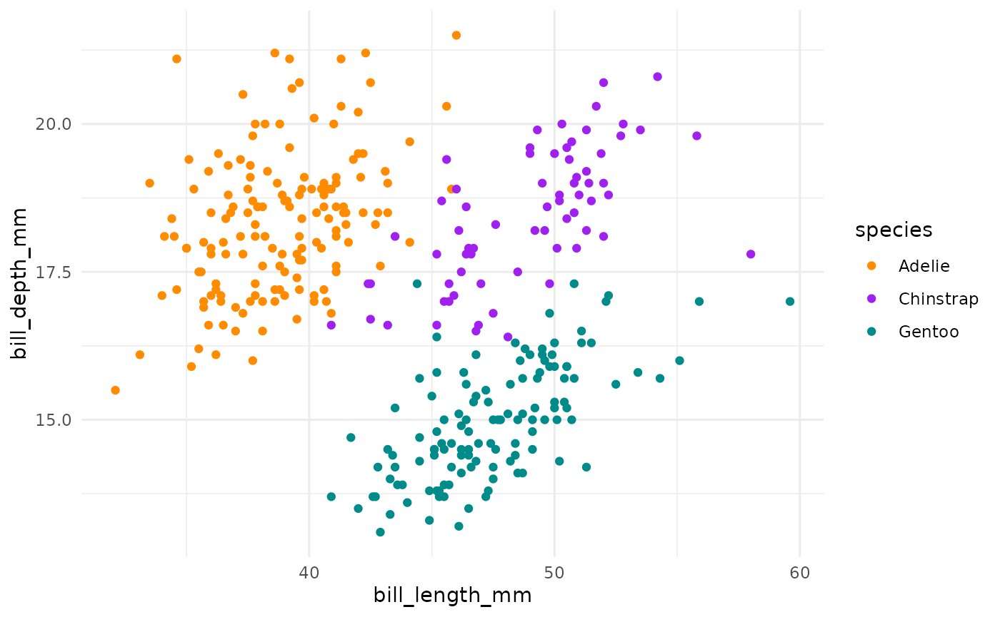

```{r setup, include=FALSE, echo=FALSE}
knitr::opts_chunk$set

library(tidyverse)
library(palmerpenguins)
library(GGally)
library(kableExtra)
```

**Title**: The title of your groundbreaking research paper

First Author^1^\*, Second Author^1^, Third Author^2,1^

1.  Dept. of Biology, Institution A, City, Province, Country

2.  Environmental Science Centre, Governmental Organisation, City, Province, Country

\*Corresponding Author

email: first.author\@institutiona.ca (FA)

**Author Contributions:** FA conceived of the study, conducted the analyses, and wrote the original, and revised drafts of the manuscript. SA, and TA, helped with the draft manuscript and revisions and supplied guidance to FA. TA provided the data for the case study, contributed to the revisions, and assisted with the analysis of the case study data.

**Data Availability:** The data and code that support the findings of this study are openly available on Zenodo / GitHub at <https://link_to_archived_release_or_GitHub.com>.

If I was publishing this as an HTML document and wanted the link to be pretty versus human readable, I would use [this format](https://link_to_archived_release_or_GitHub.com) instead

**Conflict of Interest statement**

No conflicts of interest

**Acknowledgements:** We would like to thank a whole bunch of people.

\newpage

# Abstract

1.  Ecologists often have lots of questions about lots of stuff

2.  We evaluated a bunch of things using sophisticated methods and carried out complicated statistical tests

3.  We discovered a bunch of things that we didn't already know but suspected

4.  Our research has greatly advanced out knowledge about stuff and will make a significant contribution to something and someone

**Key-words**: stuff, something

\newpage

# Introduction

Ecologists have long recognized that some combinations of species are regularly found together, while other combinations occur infrequently [@Cole:1949dz; @Elton:1946dl]. This format wraps the citation in brackets but if you want to reference the authors by name instead of just as a citation you can use this format instead (i.e., no square brackets around the cite key)

@Cole:1949dz and @Elton:1946dl both found that

# Methods

To evaluate the ...

As with Pielou's Evenness [@Pielou:1967ea], Shannon's diversity index [@Shannon:1948iy]$(H)$ is normally calculated from species abundance values; however, for our purposes it is calculated from the column totals (species richness per sample) using the following equation...

$$
H_x = -S[P(i_x) \times ln(P(i_x))]
$$

where $x$ denotes which set of values we are using to calculate the index (observed, minimal or maximal), and $P(i_x)$ is the proportion of species that occur in each sample $(i)$.

The above demonstrates both "inline" and "display" math formats. If you look at the Source version you will see that it is simply the number of \$ symbols before and after that differentiates between the two. An excellent (and simple) guide on inserting math into your R Markdown documents can be found here:\
<https://rpruim.github.io/s341/S19/from-class/MathinRmd.html>

Statistical analyses were carried out in R 3.4.0 (R Core Team 2017). All code along with the simulation algorithms used are available on Zenodo / GitHub <https://link_to_archived_release_or_GitHub.com>.

# Results

# Discussion

# References

::: {#refs}
:::

\newpage

# Tables

**Table 1.** Mean body mass of penguins on different islands over time.

```{r table_01, echo=FALSE, message=FALSE, warning=FALSE, paged.print=TRUE}
penguin_sum <- penguins %>%
  group_by(island, year) %>%
  summarize(mean_body_mass_g = mean(body_mass_g, na.rm = TRUE)) %>% 
  ungroup()

kable(x = penguin_sum, 
      col.names = c("Island", "Year", "Mean Body Mass (g)")) %>%
  kable_styling(latex_options = "hold_position") 
# without the "hold_position" the table ends up at the top of the page

```

\newpage

# Figure Captions

**Figure 1**.

**Figure 2**.

\newpage

# Figures



Figure 1.

\newpage

```{r figure_02, echo=FALSE, message=FALSE, warning=FALSE}
penguins %>%
  select(species, body_mass_g, ends_with("_mm")) %>% 
  GGally::ggpairs(aes(color = species),
          columns = c("flipper_length_mm", "body_mass_g", 
                      "bill_length_mm", "bill_depth_mm")) +
  scale_colour_manual(values = c("darkorange","purple","cyan4")) +
  scale_fill_manual(values = c("darkorange","purple","cyan4"))
```

Figure 2.

\newpage

Figure 3.

```{r file="../scripts/figure_03.R"}
# this code chunk calls an external script to generate the plot. If you
# want to load or run code not for a plot you could also use the following.
# Note that it does not seem to work for plots.
# source("../scripts/figure_03.R", local = knitr::knit_global())
```

\newpage

# Appendices
